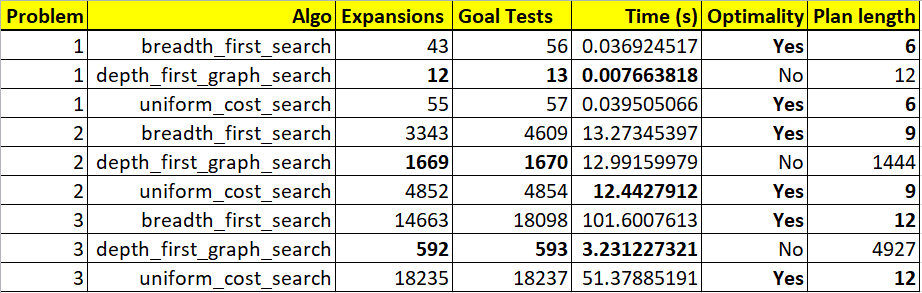
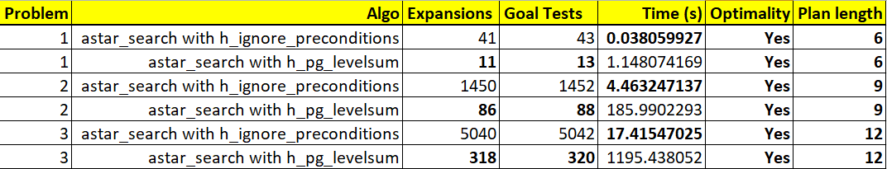

# Introduction

# Optimal plans 

Note, there may be more than 1 optimal solution for each of the problems.

### Problem 1

    Load(C1, P1, SFO)
    Fly(P1, SFO, JFK)
    Unload(C1, P1, JFK)
    Load(C2, P2, JFK)
    Fly(P2, JFK, SFO)
    Unload(C2, P2, SFO)

### Problem 2

    Load(C3, P3, ATL)
    Fly(P3, ATL, SFO)
    Unload(C3, P3, SFO)
    Load(C1, P1, SFO)
    Fly(P1, SFO, JFK)
    Unload(C1, P1, JFK)
    Load(C2, P2, JFK)
    Fly(P2, JFK, SFO)
    Unload(C2, P2, SFO)

### Problem 3
    
    Load(C2, P2, JFK)
    Fly(P2, JFK, ORD)
    Load(C4, P2, ORD)
    Fly(P2, ORD, SFO)
    Unload(C4, P2, SFO)
    Load(C1, P1, SFO)
    Fly(P1, SFO, ATL)
    Load(C3, P1, ATL)
    Fly(P1, ATL, JFK)
    Unload(C3, P1, JFK)
    Unload(C1, P1, JFK)
    Unload(C2, P2, SFO)

# Comparison of non-heuristic search result metrics

(optimality, time elapsed, number of node expansions) for Problems 1,2, and 3. Include breadth-first, depth-first, and at least one other uninformed non-heuristic search in your comparison; Your third choice of non-heuristic search may be skipped for Problem 3 if it takes longer than 10 minutes to run, but a note in this case should be included.

# Comparison of heuristic search result metrics

using A* with the "ignore preconditions" and "level-sum" heuristics for Problems 1, 2, and 3.

# Discussion

What was the best heuristic used in these problems? Was it better than non-heuristic search planning methods for all problems? Why or why not?

`test`